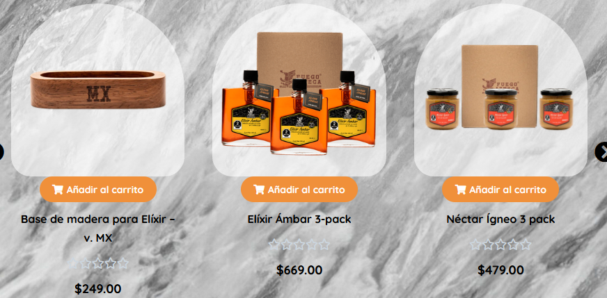

# TI3005B-Cloud

## Propuesta 

1. _Mejorar la recolección de datos para tener analytics_
  * Si desean seguir con Woocomerce, utilizar el dashboard incluido.
    * Se podría complementar con un dashboard auxiliar que lea de woocomerse y genere reportes.
  * De lo contrario, migrar a una herramienta más “poderosa” como Shopify.

2. Dar mantenimiento general a sus puntos de venta, y a la página.
  * Elegir opciones de hosting más robustas.
    * Actualmente utilizan Wordpress, con Woocomerce para manejar la parte de e-comerse y Stripe y Paypal como gestor de pagos.
  * Mejorar temas de UI/UX para buena experiencia de cliente.
    * El fondo no es placentero y es distractor.
    * No se puede distinguir las estrellas de ratings.
      
  * Unificar las plataformas para una experiencia más coherente.
    * Dominios en EEUU y Europa ya no están activos. 
3. Hacer Ad Campaigns. Utilizar Google Ads o similar para poder servir anuncios en páginas web, Youtube, etc.
  * Woocommerse tiene integración con Google Ads entonces no requiere un refactor grande de sus plataformas.
  * Si se decide abandonar los sitios de venta en línea.
  * Para campañas publicitarías en México, se pueden utilizar plataformas para conectar con influencers. Lizza 

4. Hacer un esquema de subscripciones estilo Hello Fresh, para mandar salsas a sus cliente de forma periódica y temática.

